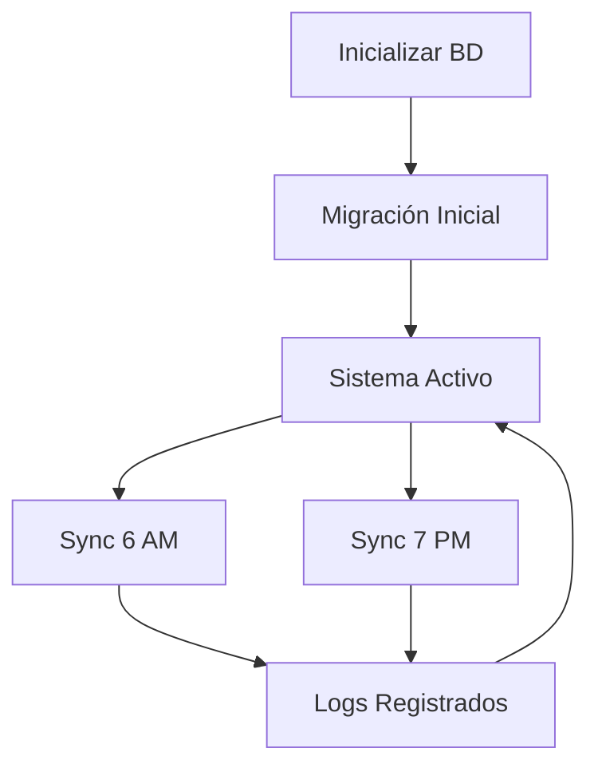

# Migración y Sincronización de Google Sheets a MySQL

## 📋 Resumen

Este sistema permite sincronizar automáticamente los datos del Google Sheet "FINAL PLANIFICACION-DB" con la base de datos MySQL.

### Características:
- ✅ **Migración inicial**: Carga todos los datos del sheet a MySQL (solo una vez)
- ✅ **Sincronización automática**: Se ejecuta 2 veces al día (6 AM y 7 PM)
- ✅ **Comparación inteligente**: Solo actualiza lo que cambió
- ✅ **Logs de auditoría**: Registra todas las sincronizaciones
- ✅ **Fallback local**: Si Google Sheets no está disponible, usa CSV local

---

## 🚀 Paso 1: Inicializar la Base de Datos

Antes de migrar, necesitas crear las tablas en MySQL:

```bash
cd backend
npm run init-db
```

Este comando creará las siguientes tablas:
- `motivos` - Motivos de baja
- `ventas` - Datos de ventas
- `clientes` - Clientes
- `reportes` - Histórico de reportes
- **`planificacion_rutas`** - Planificación de rutas y vendedores (NUEVA)
- **`sync_log`** - Logs de sincronización (NUEVA)

---

## 📥 Paso 2: Migración Inicial (Solo UNA vez)

La migración inicial carga todos los datos del Google Sheet a la base de datos.

### Opción A: Usando el endpoint de API

```bash
curl -X POST http://localhost:3001/api/planificacion/migrar
```

### Opción B: Desde el panel de administrador (próximamente)

En el futuro, se agregará un botón en el panel de administrador para ejecutar la migración.

### ⚠️ Importante:
- Solo ejecuta la migración **UNA VEZ**
- Si ya hay datos en la tabla `planificacion_rutas`, la migración será rechazada
- Si necesitas rehacer la migración, primero limpia la tabla manualmente

### Resultado esperado:

```json
{
  "success": true,
  "message": "Migración inicial completada exitosamente",
  "insertados": 209
}
```

---

## 🔄 Paso 3: Sincronizaciones Automáticas

Una vez completada la migración inicial, el sistema sincronizará automáticamente:

- **6:00 AM** - Primera sincronización del día
- **7:00 PM** - Segunda sincronización del día

### ¿Qué hace la sincronización?

1. Lee el Google Sheet actual
2. Compara con los datos en MySQL
3. **INSERT**: Si encuentra rutas nuevas
4. **UPDATE**: Si detecta cambios en rutas existentes
5. Registra el log de la sincronización

### Sincronización manual (opcional):

Si necesitas sincronizar manualmente:

```bash
curl -X POST http://localhost:3001/api/planificacion/sincronizar
```

Resultado:

```json
{
  "success": true,
  "message": "Sincronización completada exitosamente",
  "insertados": 5,
  "actualizados": 12,
  "sinCambios": 192
}
```

---

## 📊 Paso 4: Verificar Estadísticas

Consulta las estadísticas de sincronización:

```bash
curl http://localhost:3001/api/planificacion/stats
```

Respuesta:

```json
{
  "success": true,
  "stats": {
    "totalRutas": 209,
    "totalZonas": 2,
    "totalVendedores": 25,
    "zonas": ["SC DTS 1", "SC DTS 2"],
    "totalSincronizaciones": 15,
    "exitosas": 14,
    "fallidas": 1,
    "ultimaSincronizacion": "2025-11-21 18:30:00"
  }
}
```

---

## 📝 Logs de Sincronización

Ver últimas sincronizaciones:

```bash
curl http://localhost:3001/api/planificacion/sync-logs?limit=10
```

Respuesta:

```json
{
  "success": true,
  "total": 10,
  "logs": [
    {
      "id": 15,
      "tipo_sync": "UPDATE",
      "registros_insertados": 5,
      "registros_actualizados": 12,
      "registros_sin_cambios": 192,
      "estado": "SUCCESS",
      "fecha_sync": "2025-11-21 19:00:00"
    }
  ]
}
```

---

## 🔍 Consultar Rutas

### Obtener todas las rutas:

```bash
curl http://localhost:3001/api/planificacion/rutas
```

### Buscar ruta específica:

```bash
curl http://localhost:3001/api/planificacion/rutas/SC-RUTA%2011
```

### Buscar por vendedor:

```bash
curl http://localhost:3001/api/planificacion/vendedor/ALEJANDRA
```

### Buscar por zona:

```bash
curl http://localhost:3001/api/planificacion/zona/SC%20DTS%201
```

---

## ⚙️ Configuración

### Variables de entorno (`.env`):

```env
# Google Sheets URL (debe ser público)
GOOGLE_SHEET_URL=https://docs.google.com/spreadsheets/d/194h50bW_W0p7BKGl-JnUOPTLYhMT7Py8yI6xj3rKqEo/export?format=csv&gid=1023925717
```

### Estructura del CSV esperada:

```csv
RUTA,ZONA,DIA,VENDEDOR
SC-RUTA 11,SC DTS 1,3-MI,ALEJANDRA TANIA GUANACO PAYE
SC-RUTA 143,SC DTS 1,3-MI,CRISTIAN ANDRES ARAUZ VACA
...
```

---

## 🛠️ Troubleshooting

### Problema: Error al leer Google Sheet

**Solución**: El sistema automáticamente usará el CSV local de respaldo ubicado en:
```
backend/reportes/PLANIFICACION - FINAL PLANIFICACION-DB.csv
```

### Problema: Ya existen datos en la base de datos

**Solución**: Si necesitas rehacer la migración inicial:

```sql
-- Conectarse a MySQL
USE sistema_bajas;

-- Limpiar tablas
TRUNCATE TABLE planificacion_rutas;
TRUNCATE TABLE sync_log;
```

Luego ejecuta la migración nuevamente.

### Problema: El scheduler no se inicia

**Verificar logs del servidor**:
```bash
npm run dev
```

Deberías ver:
```
✅ Scheduler activo (sync: 6 AM y 7 PM)
```

---

## 📌 Endpoints Disponibles

| Método | Endpoint | Descripción |
|--------|----------|-------------|
| GET | `/api/planificacion/rutas` | Obtener todas las rutas |
| GET | `/api/planificacion/rutas/:codigo` | Obtener ruta específica |
| GET | `/api/planificacion/vendedor/:nombre` | Buscar por vendedor |
| GET | `/api/planificacion/zona/:zona` | Buscar por zona |
| GET | `/api/planificacion/stats` | Estadísticas generales |
| GET | `/api/planificacion/sync-logs` | Logs de sincronización |
| POST | `/api/planificacion/migrar` | Ejecutar migración inicial |
| POST | `/api/planificacion/sincronizar` | Sincronización manual |

---

## 🎯 Flujo Completo



---

## ✅ Checklist de Implementación

- [x] Crear modelos `PlanificacionRuta` y `SyncLog`
- [x] Implementar servicio de sincronización
- [x] Crear scheduler con cron jobs (6 AM y 7 PM)
- [x] Crear endpoints de API
- [x] Integrar con servidor principal
- [x] Agregar `node-cron` a dependencias
- [x] Documentación completa

---

## 📞 Soporte

Si tienes problemas con la migración o sincronización, verifica:

1. ✅ MySQL está corriendo
2. ✅ Las credenciales en `.env` son correctas
3. ✅ El Google Sheet es público
4. ✅ El servidor backend está corriendo (`npm run dev`)
5. ✅ Los logs del servidor no muestran errores

---

**Fecha de creación**: 2025-11-21
**Versión**: 1.0.0
**Autor**: Sistema de Bajas Cruzimex
